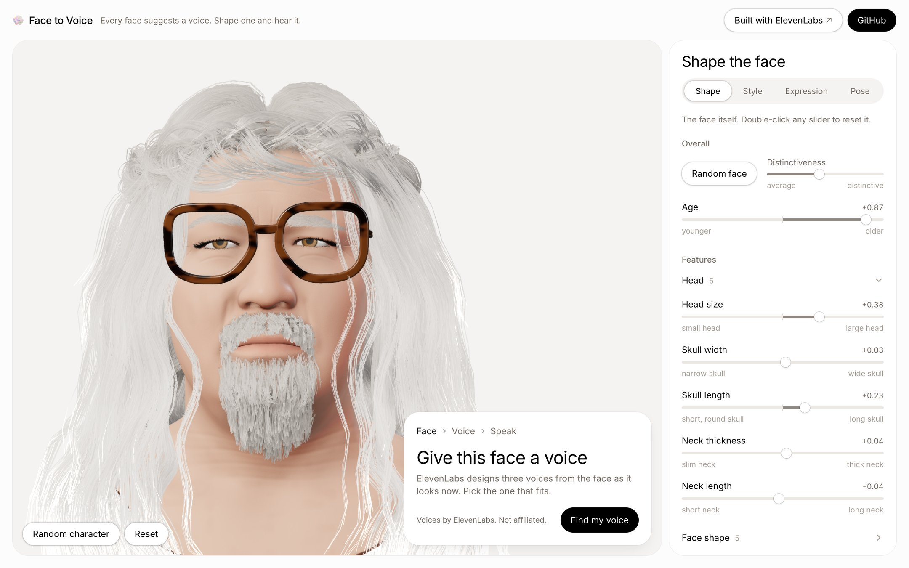

# Face to Voice

[](https://github.com/OliverA100/face-to-voice/actions/workflows/ci.yml)

**Try it: [facetovoice.com](https://facetovoice.com)**

Shape a realistic 3D head, style it, give it an expression, and hear the voice it suggests. Claude casts the
character from the face, ElevenLabs designs three matching voices, and the head lip-syncs to every line it speaks.



The head is Google's [GNM Head](https://github.com/google/GNM), a linear statistical model of the human head,
exported to the browser as glTF morph targets. Everything on top of it (semantic sliders, a geometry limiter, strand
hair, add-ons, expressions, the voice pipeline and lip sync) is this repository.

**Contents:** [Highlights](#engineering-highlights) · [How it works](#how-it-works) ·
[How ElevenLabs is used](#how-elevenlabs-is-used) · [Run it](#run-it) · [Responsible AI](#responsible-ai) ·
[Credits and licences](#credits-and-licences) · [Architecture](docs/architecture.md)

## Engineering highlights

| | |
|---|---|
| Model export | 125 morph targets, every vertex and delta within 6 µm of the source; 2.88 MB brotli for both files |
| Limiter | blocks only impossible geometry; a slider grab costs one frame, per-face animation caps run off the main thread |
| Stress test | the real app driven through 8 families of states in headless Chrome, each exact-checked: 0 of 223 single-slider ends and 0 of 4,224 slider pairs broken |
| Load | head visible after 0.42 s on desktop, 0.66–0.75 s on a phone (4× CPU); 565 KB initial JS gzip |
| Frame time | 60 fps on a phone profile while dragging, switching emotions and speaking; Lighthouse performance 99 / 61–62 |
| Accessibility | WCAG 2.2 AA pass: radio-group chip rows, sliders that announce their value in words, a text alternative for the head; Lighthouse 100 / 96 |
| Tests | 261 vitest tests (web) and 162 pytest tests (pipeline), run in CI on every push |

Measured on an M4 Pro with headless Chrome; phone numbers use a 390×844 viewport at DPR 3 with 4× CPU throttling.

## How it works

```
 pipeline/ (Python, offline)                     web/ (Next.js, React Three Fiber)
 ───────────────────────────                     ───────────────────────────────────────────────
 GNM Head (253 identity + 383 expression          head.glb + head.extra.glb (morph targets)
   components, numpy)                               │  sliders write morph weights, no React renders
   ├─ export: parts, morph targets, meshopt   ──►   │  vertex limiter blocks impossible geometry
   ├─ semantic sliders solved on the model          │  strand hair + add-ons follow the skin
   ├─ slider ranges vs adult anthropometry          │  expression, pose, idle life, age wrinkles
   ├─ limiter data + automated stress test          ▼
   └─ hair, brows, lashes, beards, glasses      screenshot + look ──► /api/voice/design
                                                       Claude casts the character (structured output)
                                                       ElevenLabs Voice Design → 3 previews
                                                 pick one ──► /api/voice/select (save, voice pool)
                                                 speak    ──► /api/voice/speak
                                                       eleven_v4_turbo stream with character timestamps
                                                       ──► Web Audio + viseme cues ──► mouth morphs
```

**The head.** GNM is linear, so each of its components bakes into an exact glTF morph target. The pipeline exports 30
identity and 40 expression components, and `uv run verify` checks every vertex and morph delta against the source. The
33 **Shape** sliders (jaw width, eye spacing, lip fullness …) are not raw components but directions solved on the
model, each moving its own measurement while holding the others. Every slider end sits at ±4.5 SD of its feature,
checked against adult anthropometry (ANSUR II, NIOSH, 3DFN). [More](docs/architecture.md#pipeline--morph-targets)

**Only impossible faces are blocked.** Weird faces are allowed; skin through the eyeball, lips through each other or
teeth through the cheek are not. Exact checks in the pipeline find what breaks, and a fast mirror in the app turns
each slider's track into "as far as this face allows" and caps the blink, emotion and mouth shapes per face. An
automated stress test proves it on thousands of app states. [More](docs/architecture.md#the-limiter-and-the-stress-test)

**Hair and add-ons on a morphing face.** 228 strand hair styles are drawn on the GPU (camera-facing ribbons, child
strands generated around each guide, Kajiya-Kay shading), with every root tied to the skin so hair moves with sliders,
blinks and expressions. Eyebrows, lashes, beards and glasses are generated by the pipeline; glasses refit at runtime to
wide or long heads. [More](docs/architecture.md#hair-and-add-ons)

**Expression and voice.** Twelve emotions come from GNM's ExpressionSampler, with Fine-tune controls that go as far as
the emotion leaves room for. Claude casts the character from a screenshot into a fixed schema; a template turns that
into an ElevenLabs Voice Design prompt; the chosen take speaks with `eleven_v4_turbo`, and the lip sync places every
p/b/m, f/v and th closure on the audio itself. [More](docs/architecture.md#voice-and-lip-sync)

**Export.** "Download character" builds a zip in the browser: a transparent portrait, the casting and voice prompt,
the chosen take, a rebuild link, and a licence file written from the licence of each piece the character wears.
[More](docs/architecture.md#export)

## How ElevenLabs is used

| | |
|---|---|
| **Voice Design from the face** | `POST /v1/text-to-voice/design` with `eleven_ttv_v3`. The description is assembled from Claude's casting by a fixed template, and the preview text is the character's own line, so the three previews already sound in character. |
| **Text to speech** | `POST /v1/text-to-speech/{voice}/stream/with-timestamps`, `eleven_v4_turbo`, `pcm_24000`, passed straight through to the browser. The expression rides along as an audio tag at three strengths. |
| **Timestamps → lip sync** | Character times become viseme cues; closures and vowels are then snapped to the audio's loudness, since word-medial stamps can be ~100 ms off. |
| **Latency** | First audio about 0.3 s after the request (0.4 s with an expression tag); playback starts on the first chunk. |
| **Caching** | Voices are cached per voice description (a design is never paid for twice), castings per visitor and face, spoken lines in Vercel Blob by voice and text, and only when the stream was the whole line. |
| **Voice slots** | Saved voices live in a small LRU pool sized to the plan; when the day's saves or the month's operations run out, the visitor gets the closest pre-designed studio voice instead of an error. |
| **Rate limits and cost** | Same-origin, Vercel BotID, per-visitor limits and global daily caps in Upstash Redis on every paid route; one request at a time designs a description or saves a take. Production refuses to run without Redis. |
| **Mock mode** | `FTV_MOCK_ELEVENLABS=1` and `FTV_MOCK_CLAUDE=1` replace every paid call, so the whole flow and the lip sync run without keys. |

## Run it

Requirements: Node 22.18+, pnpm, and for the pipeline Python 3.13 with [uv](https://docs.astral.sh/uv/).

```bash
cp .env.example web/.env.local     # FTV_MOCK_ELEVENLABS=1 and FTV_MOCK_CLAUDE=1 run everything without keys
cd web && pnpm install
pnpm fetch-hair                    # the 228 hair styles (~220 MB), not in git
pnpm dev                           # http://localhost:3000
```

- **Without keys**, with both mocks on, everything runs: every slider, styling, expression, pose, the voice flow
  (generated tones with lip sync) and export. A real casting needs `ANTHROPIC_API_KEY` (about a cent per face); Voice
  Design needs an ElevenLabs paid plan (Starter is enough).
- **Without the hair files** the app works bald, and the hair panel says how to get them.
- Debug views: `?perf=1` (fps, draw calls, load timings) and `?lipsync=1` (viseme timeline).

```bash
cd web && pnpm test && pnpm lint && pnpm typecheck
cd pipeline && uv sync && uv run pytest && uv run ruff check && uv run verify
```

Deploying: [DEPLOY.md](DEPLOY.md) (Vercel, Upstash Redis, Vercel Blob, BotID, per-key quotas).

## Repository layout

| Folder | What it is |
|---|---|
| `web/` | Next.js 16 app: `src/components/scene` (React Three Fiber), `src/components/ui` (panel, voice card), `src/lib/morphs` (morph store, limiter, random faces), `src/lib/lipsync`, `src/lib/server` (Claude, ElevenLabs, caches, limits), `src/lib/export` |
| `pipeline/` | Python tools: GNM export and verification, semantic sliders, ranges and validation, emotions, hair and add-ons. See [pipeline/README.md](pipeline/README.md) |
| `docs/` | [architecture](docs/architecture.md), [responsible AI](docs/responsible-ai.md), [design tokens](docs/design.md) |
| `third_party/` | Licences of bundled third-party work (see `NOTICE`) |

## Responsible AI

The characters are synthetic heads, and the casting leans into stereotypes on purpose, the way game casting does. The
guard rails: Claude must never name or guess a real person; no voice is cloned (Voice Design creates new voices from a
text description); no free text from the browser reaches a prompt; every paid call is rate-limited and capped.
Details: [docs/responsible-ai.md](docs/responsible-ai.md).

## Credits and licences

Code: MIT ([LICENSE](LICENSE)). Third-party work and the licence of every shipped asset: [NOTICE](NOTICE).

- **Head model:** [GNM Head v3.0](https://github.com/google/GNM) by Google LLC, Apache License 2.0. Ploumpis et al.,
  *GNM Head: A Generative aNthropometric Model of the human head*, arXiv:2607.23687.
- **Hair:** 223 styles from [HairCS](https://huggingface.co/datasets/HairCS2027/HairCS) (Lu et al., arXiv:2609.16465),
  **CC BY-NC 4.0, non-commercial only**; 4 from Daniel Bystedt's Blender "Hair Styles" demo, CC BY-SA 4.0; 1 procedural
  groom of our own, MIT. An exported character with HairCS hair is non-commercial; its zip says so.
- **Add-ons:** generated here (MIT). MakeHuman's CC0 brow cards and four community beards serve as shape guides only.
- **Lip sync:** English letter-to-viseme rules adapted from [TalkingHead](https://github.com/met4citizen/TalkingHead)
  by Mika Suominen, MIT.
- **Controls** inspired by Google's [XR Blocks GNM demo](https://github.com/google/xrblocks/tree/main/samples/avatar_lab/gnm)
  (ideas only, no code).
- **Voices and speech** by [ElevenLabs](https://elevenlabs.io); casting and slider names by
  [Claude](https://www.anthropic.com/claude).
- **Built with [Claude Code](https://www.anthropic.com/claude-code)** as a pair programmer.

The UI's design language is inspired by elevenlabs.io; no ElevenLabs logo, wordmark or asset is used. This is an
independent project, not affiliated with or endorsed by ElevenLabs, Google or Anthropic.
